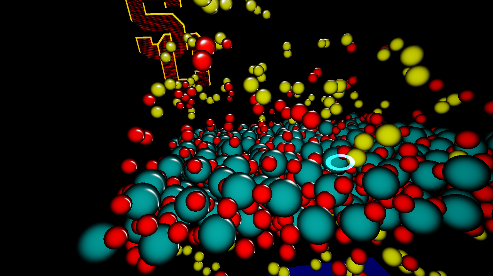
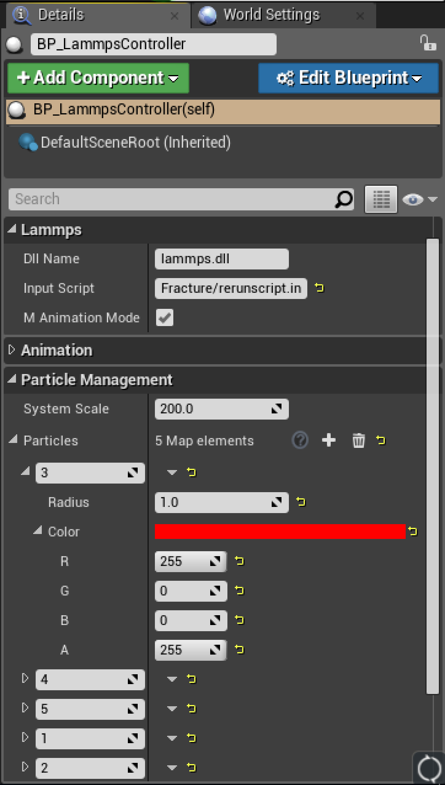
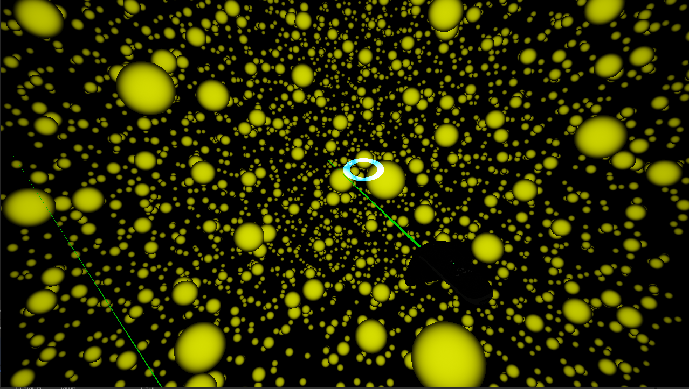

# GEARS in Unreal Engine 4.25 (with LAMMPS and eye tracking)

Note: This is a fork of [USCCACS/GEARS](https://github.com/USCCACS/GEARS/) to add eye tracking for the HTC VIVE Pro Eye. Note that this version uses UE4.25 instead of 4.16.

<div align="center">
     
</div>

## Overview

GEARS is a program that visualizes the molecular dynamics library [LAMMPS](http://lammps.sandia.gov/), developed by [Sandia National Laboratories](http://www.sandia.gov/), in virtual reality. Because of this, it offers the ability to run custom LAMMPS scripts and also comes with a few demos. Look at [USCCACS/GEARS](https://github.com/USCCACS/GEARS/) for more GEARS-specific information. This fork, which works with the HTC VIVE Pro Eye headset, adds a circle on top of the preview window that shows where the user is looking.

## System Requirements
* [HTC VIVE Pro Eye](https://www.vive.com/eu/product/vive-pro-eye/overview/) with Motion Controllers
* [Windows 10 OS](https://www.microsoft.com/en-us/windows/) (64-bit Version Recommended)
* [Unreal Engine 4.25](https://www.unrealengine.com/en-US/what-is-unreal-engine-4)
* [Visual Studio 2019](https://visualstudio.microsoft.com/vs/)
* The [HTC VIVE runtime](https://www.vive.com/us/setup/)
* [Steam and SteamVR](http://store.steampowered.com)
* The [VIVE eye tracking SDK](https://developer.vive.com/resources/knowledgebase/vive-sranipal-sdk/) plugin for Unreal (you will need a Vive account - see installation instructions)

## Installation
1. Install the Epic Games Launcher and Unreal Engine 4 from the [Epic Games](https://www.unrealengine.com/what-is-unreal-engine-4) website. The current project was developed in version 4.25. Also install [Visual Studio 2019](https://visualstudio.microsoft.com/vs/) including the packages for game development with C++ (if you haven't already)
2. Install the [HTC Vive runtime](https://www.vive.com/us/setup/) as well as [Steam and SteamVR](http://store.steampowered.com) (if you haven't already)
3. Clone this repository (`git clone https://github.com/jhame101/GearsEye.git`). Alternatively, download the zip from github
4. Follow part 3 of [this guide](https://forum.vive.com/topic/7434-getting-started-with-vrs-foveated-rendering-using-htc-vive-pro-eye-unreal-engine/?ct=1582025406) to set up eye tracking and install the SRanipal plugin. You may need to disable privacy and security plugins or use a less secure browser  to do the actual downloads because the website is badly designed.
	* The error mentioned at step 13 will show up, and there will also be an error in both `SRanipal_AvatarEyeSample.cpp` and `SRanipal_AvatarEyeSample_v2.cpp`. To fix that, replace both instances of
	```cpp
	ModelGazeOrigin = EyeAnchors[eye]->RelativeLocation;
	ModelGazeTarget = EyeAnchors[eye]->RelativeLocation + GazeDirectionCombinedLocal;
	```
	with
	```cpp
	ModelGazeOrigin = EyeAnchors[eye]->GetRelativeLocation();
	ModelGazeTarget = EyeAnchors[eye]->GetRelativeLocation() + GazeDirectionCombinedLocal;
	```
5. Generate Visual Studio files by right clicking the Unreal project file (LammpsVR.uproject).

  *If your computer does not associate .uproject files with the Unreal Editor, then you may have to open up the .uproject file via the Epic Games Launcher first.*
  
* See the [USCCACS/GEARS](https://github.com/USCCACS/GEARS/) Unreal README for an introduction to the Unreal editor

## How to use LammpsVR Editor
1. Start LammpsVR.uproject using Unreal Editor 4.25. Ensure that SteamVR has also started and all equipment (Vive Pro Eye, controllers) is connected
2. Start the SR_Runtime application as administrator
3. In the Content Browser, go to Levels/Demo1-RealtimeSim/ for real time simulation demos. Alternatively, just use the default level and try other ones using number keys.
4. Press the "Play - VR Preview" option in the top window, and put on the headset.

### Controls:
  Using motion controller, point green laser in direction that you want to move. Press either the right or left trigger buttons on the motion controllers to move in the direction that controller's green laser is pointing.

  To pause the simulation (whether real time or animation), click the circular directional pad.

  To exit your current level, press the ESC key on the keyboard.

### How to customize LammpsVR levels

  Perhaps you would like to put your own simulation in the LammpsVR editor, and watch it for yourself. To do that,

  1. Prepare a LAMMPS script for your simulation and add ```run 0``` to the end of it.
  2. Place it in the LammpsResource/Scripts/ directory. If the LAMMPS script references other data files, be sure to include them at their proper relative locations.
  
      *Some LAMMPS commands may not work depending on what they do. For example, if the LAMMPS command requires a specific amount of CPUs, or references an MPI related command for example, they could cause the simulation to stall. Refer to the LAMMPS script we have provided for all tested LAMMPS commands.*

  3. Select a demo level as before, then select the BP_LammpsController in the **World Outlier** window. Go to its details in the **Details** window (pictured below).

  <div align="center">
       
  </div><br>

  4. Fill out the *Lammps*, *Animation*, and *Particle Management* sections in the window with references to your custom LAMMPS scripts withing the LammpsResource/ directory. This includes file paths, particle number to size and color associations, and even a choice to turn on animation mode. If animation mode is selected, be sure to include details about the animations time step files in the *Animation* section. All time step files must be in the LAMMPS DUMMP format. Additionally, the input script needs to be set up in a particular way. We will post a guide to this soon, so for now refer to our LAMMPS script, *LammpsResource/Scripts/Fracture/rerunscript.in*, as an example.

  5. Press Play.

### Extra LAMMPS Input Script Rules reiterated:
  * The current working directory gets set to the LammpsVR/Content/LammpsResource/. Therefore, if a LAMMPS input script references another file, the path to that file must start from the LammpsResource directory.
  * LAMMPS commands that are not compatible with the compiled DLL will cause the LAMMPS instance to freeze or crash. For example, MPI is not included in our provided DLL. Therefore, if a LAMMPS input script makes use of the "processor" command, the engine will crash. The engine also freezes in instances where the LAMMPS input script references a file that does not exits. Therefore, always double check your path names.
  * For animation mode, the LAMMPS input script must setup the LAMMPS system before running. Because the animation mode does not actually use any of the force calculations, dummy values for the system initial parameters can be used. For example, one can setup the animation system in their LAMMPS input script via the following LAMMPS commands:
  ```
  boundary  p p p
  atom_style atomic
  read_data path/to/sim/data/file.data
  pair_style  zero 5.0
  pair_coeff  * *
  mass 1 1.0
  mass 2 1.0
  mass 3 1.0
  mass 4 1.0
  thermo_style custom step temp etotal
  thermo 1
  ```

### Demo 1: Real-time Simulations
For this demo, we display the real time simulation capabilities of GEARS. In the Content/Levels/Demo1/ directory, you'll find several samples levels each of which is running a different LAMMPS simulation. Through these data sets you will see the various LAMMPS commands that the system is able to handle as well.

* The first example is a basic Lennard Jones molecular dynamics simulation, where all particles are of a single type.
* The second example is a simulation of Nano-porous Silica. In this example, the initial configuration is set via a separate .data file and the Vashishta pairstyle is utilized in the simulation.
* The third example simulates chemical vapor deposition, using both an initial configuration, pair style, and reaxff force field package compiled into our LAMMPS Dll.

### Demo 2: Animation
* This demo is currently not working

For this demo, we show the capabilities of GEARS to rerun previously computed simulations, effectively acting as an simulation animator in virtual reality. Our demo runs several thousand time steps of a 100,000 particle simulation precomputed on the University of Southern California's high performance computing cluster.

Navigate to the FractureWorld level in the Contents windows, double click it, then press play. One can pause and unpause the animation by pressing the face buttons on their Vive Motion Controller.

<div align="center">
     
</div>
